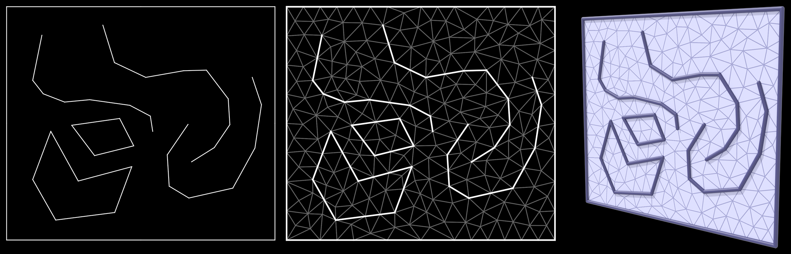

# triangulate-svg

Simple [Mathematica](https://www.wolfram.com/mathematica/) notebook for triangulation of curves directly from paths in an SVG file.  Points and segments from all `polyline` and `polygon` elements are used as input to constrained Delaunay triangulation.  Internally, Mathematica uses Shewchuk's [Triangle](https://www.cs.cmu.edu/~quake/triangle.html) library.

Output is a [Wavefront OBJ](https://en.wikipedia.org/wiki/Wavefront_.obj_file) file, where the (possibly subdivided) input segments are stored as `l` lines.
